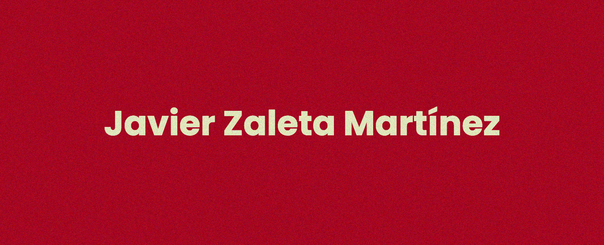

## 👋 Hey! Welcome to my makerspace!

## 📕 About

###### ◕ ◡ ◕ っ

> 🌐 [✦ Go to visit my website!](https://jzaleta.vercel.app/) 

**I'm Javier:**

19 y/o 🇲🇽 Med Student 🩺 • Software Engineer 💻 • 🛠️ Dev & Maker of things • 📸 Photography enthusiast • 📚 Bookworm

## 🛠️ Skills
I'm currently pursuing web and game development!

- HTML and CSS
- JavaScript
- React, Next, Astro, Tailwind 
- Go, Python

## 🤖 💻 📸 Hobbies
In no particular order...
- Tinkering with software engineering projects
- Reading awesome books
- Playing video games
- Photography 
- Listening to music and making Spotify playlists 

## 📋 GitHub Stats and Activity

<table>
<thead>
  <tr>
    <th>
       
    </th>
    <th>
       
    </th>
  </tr>
</thead>
</table>

## 🏷️ Holopin Badges

<!--
**jzaleta/jzaleta** is a ✨ _special_ ✨ repository because its `README.md` (this file) appears on your GitHub profile.
-->
